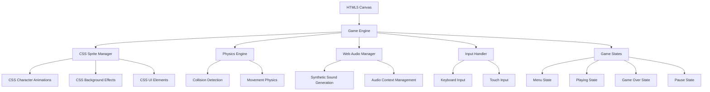
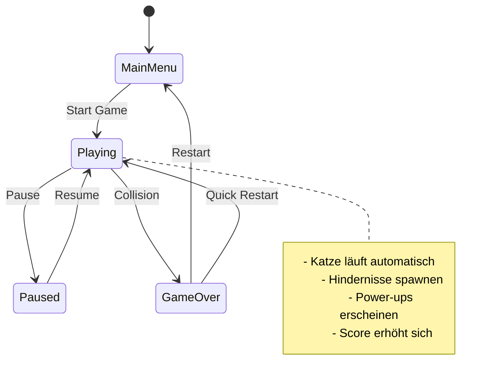

# 🐱 Katzen-Sprungspiel - Vollständiger Entwicklungsplan

## 📋 Projektübersicht
**Spielkonzept**: Ein Chrome Dino-ähnliches Browser-Spiel, bei dem eine laufende Katze über Hunde springt
- **Plattform**: HTML5 Browser-Spiel (responsive für Desktop & Mobile)
- **Grafiken**: CSS-basierte Animationen und Formen (keine externen Bilddateien)
- **Audio**: Web Audio API für synthetische Sounds (keine externen Audiodateien)
- **Features**: Power-ups, verschiedene Hindernistypen, Hintergrundwechsel

## 🎯 Kern-Spielmechaniken

### Grundlegende Mechaniken
- **Automatisches Laufen**: Katze läuft kontinuierlich nach rechts
- **Sprung-Steuerung**: 
  - Desktop: Leertaste oder Mausklick
  - Mobile: Touch-Steuerung
- **Kollisionserkennung**: Spiel endet bei Berührung mit Hindernissen
- **Punktesystem**: Punkte für übersprungene Hindernisse und gesammelte Items

### Erweiterte Features
- **Power-ups**:
  - 🚀 Doppelsprung-Fähigkeit (blaues Glühen)
  - 🛡️ Temporäre Unverwundbarkeit (goldenes Schimmern)
  - ⚡ Geschwindigkeits-Boost (rote Aura)
  - 🧲 Magnet für automatisches Sammeln von Münzen (grünes Leuchten)
- **Verschiedene Hindernistypen**:
  - 🐕 Kleine Hunde (niedrig springen) - braune Rechtecke mit Ohren
  - 🐕‍🦺 Große Hunde (hoch springen) - größere braune Formen
  - 🐦 Vogelschwärme (ducken erforderlich) - kleine fliegende Kreise
  - 📦 Kisten (statische Hindernisse) - graue Quadrate
- **Hintergrundwechsel**: CSS-Gradients für verschiedene Umgebungen

## 🏗️ Technische Architektur



## 📁 Dateistruktur

```
katzen-sprungspiel/
├── index.html              # Haupt-HTML-Datei mit eingebettetem Canvas
├── css/
│   ├── styles.css          # Haupt-Stylesheet mit Sprite-Definitionen
│   ├── animations.css      # CSS-Animationen für Charaktere
│   ├── backgrounds.css     # Hintergrund-Gradients und Effekte
│   └── responsive.css      # Mobile Anpassungen
├── js/
│   ├── game.js            # Haupt-Spiellogik und Game Loop
│   ├── player.js          # Katzen-Charakter (CSS-basiert)
│   ├── obstacles.js       # Hindernisse und Gegner
│   ├── powerups.js        # Power-up System
│   ├── background.js      # Hintergrund-Management
│   ├── audio.js           # Web Audio API Sound-Management
│   ├── input.js           # Eingabe-Handler
│   └── utils.js           # Hilfsfunktionen
└── README.md              # Projektdokumentation
```

## 🎨 CSS-basierte Grafik-Implementierung

### Katzen-Charakter (CSS)
```css
.cat {
    width: 60px;
    height: 40px;
    background: linear-gradient(45deg, #ff6b35, #f7931e);
    border-radius: 20px 20px 10px 10px;
    position: relative;
}

.cat::before { /* Ohren */
    content: '';
    position: absolute;
    top: -10px;
    left: 10px;
    width: 0;
    height: 0;
    border-left: 8px solid transparent;
    border-right: 8px solid transparent;
    border-bottom: 15px solid #ff6b35;
}

.cat::after { /* Schwanz */
    content: '';
    position: absolute;
    right: -20px;
    top: 5px;
    width: 25px;
    height: 8px;
    background: #ff6b35;
    border-radius: 10px;
    transform-origin: left center;
    animation: tailWag 0.5s infinite alternate;
}

@keyframes tailWag {
    0% { transform: rotate(-10deg); }
    100% { transform: rotate(10deg); }
}

@keyframes catRun {
    0%, 100% { transform: translateY(0px); }
    25% { transform: translateY(-2px); }
    75% { transform: translateY(-1px); }
}
```

### Hunde-Hindernisse (CSS)
```css
.dog-small {
    width: 40px;
    height: 25px;
    background: linear-gradient(45deg, #8B4513, #A0522D);
    border-radius: 15px 15px 5px 5px;
    position: relative;
}

.dog-large {
    width: 60px;
    height: 45px;
    background: linear-gradient(45deg, #654321, #8B4513);
    border-radius: 20px 20px 8px 8px;
    position: relative;
}

.dog::before { /* Ohren */
    content: '';
    position: absolute;
    top: -8px;
    left: 5px;
    width: 12px;
    height: 12px;
    background: inherit;
    border-radius: 50% 50% 0 0;
}
```

### Power-ups (CSS)
```css
.powerup {
    width: 30px;
    height: 30px;
    border-radius: 50%;
    position: relative;
    animation: float 2s ease-in-out infinite;
}

.powerup-jump {
    background: radial-gradient(circle, #00bfff, #0080ff);
    box-shadow: 0 0 20px #00bfff;
}

.powerup-shield {
    background: radial-gradient(circle, #ffd700, #ffb347);
    box-shadow: 0 0 20px #ffd700;
}

@keyframes float {
    0%, 100% { transform: translateY(0px); }
    50% { transform: translateY(-10px); }
}
```

## 🎵 Web Audio API Sound-Implementierung

### Sound-Generator Klassen
```javascript
class AudioManager {
    constructor() {
        this.audioContext = new (window.AudioContext || window.webkitAudioContext)();
        this.masterVolume = 0.3;
    }

    // Sprung-Sound (kurzer Sweep nach oben)
    playJumpSound() {
        const oscillator = this.audioContext.createOscillator();
        const gainNode = this.audioContext.createGain();
        
        oscillator.connect(gainNode);
        gainNode.connect(this.audioContext.destination);
        
        oscillator.frequency.setValueAtTime(200, this.audioContext.currentTime);
        oscillator.frequency.exponentialRampToValueAtTime(400, this.audioContext.currentTime + 0.1);
        
        gainNode.gain.setValueAtTime(this.masterVolume, this.audioContext.currentTime);
        gainNode.gain.exponentialRampToValueAtTime(0.01, this.audioContext.currentTime + 0.1);
        
        oscillator.start(this.audioContext.currentTime);
        oscillator.stop(this.audioContext.currentTime + 0.1);
    }

    // Sammel-Sound (heller Ton)
    playCollectSound() {
        const oscillator = this.audioContext.createOscillator();
        const gainNode = this.audioContext.createGain();
        
        oscillator.connect(gainNode);
        gainNode.connect(this.audioContext.destination);
        
        oscillator.frequency.setValueAtTime(800, this.audioContext.currentTime);
        oscillator.type = 'sine';
        
        gainNode.gain.setValueAtTime(this.masterVolume, this.audioContext.currentTime);
        gainNode.gain.exponentialRampToValueAtTime(0.01, this.audioContext.currentTime + 0.2);
        
        oscillator.start(this.audioContext.currentTime);
        oscillator.stop(this.audioContext.currentTime + 0.2);
    }

    // Kollisions-Sound (tiefer, rauer Ton)
    playHitSound() {
        const oscillator = this.audioContext.createOscillator();
        const gainNode = this.audioContext.createGain();
        
        oscillator.connect(gainNode);
        gainNode.connect(this.audioContext.destination);
        
        oscillator.frequency.setValueAtTime(150, this.audioContext.currentTime);
        oscillator.type = 'sawtooth';
        
        gainNode.gain.setValueAtTime(this.masterVolume, this.audioContext.currentTime);
        gainNode.gain.exponentialRampToValueAtTime(0.01, this.audioContext.currentTime + 0.3);
        
        oscillator.start(this.audioContext.currentTime);
        oscillator.stop(this.audioContext.currentTime + 0.3);
    }
}
```

## 🎮 Spielzustände und Flow



## 📱 Responsive Design Konzept

### Desktop (1024px+)
- Canvas: 1000x400px
- Tastatur-Steuerung (Leertaste)
- Detaillierte CSS-Animationen
- Vollständige UI-Elemente

### Tablet (768px - 1023px)
- Canvas: 800x350px
- Touch-Steuerung
- Optimierte Button-Größen
- Angepasste Sprite-Größen

### Mobile (< 768px)
- Canvas: 100% Breite, 300px Höhe
- Große Touch-Bereiche
- Vereinfachte Animationen
- Kompakte UI

## 🔧 Entwicklungsphasen

### Phase 1: Grundgerüst (MVP)
1. ✅ HTML5 Canvas Setup
2. ✅ CSS-basierte Katzen-Sprite
3. ✅ Basis-Spielschleife
4. ✅ Sprung-Mechanik
5. ✅ Einfache Hunde-Hindernisse (CSS)
6. ✅ Kollisionserkennung
7. ✅ Grundlegendes Scoring
8. ✅ Web Audio API Integration

### Phase 2: Erweiterte Mechaniken
1. 🔄 Power-up System implementieren
2. 🔄 Verschiedene Hindernistypen
3. 🔄 CSS-Hintergrund-Parallax
4. 🔄 Erweiterte Sound-Effekte
5. 🔄 Responsive Design

### Phase 3: Polish & Features
1. 🔄 Detaillierte CSS-Animationen
2. 🔄 CSS-Partikeleffekte
3. 🔄 Menü-System
4. 🔄 LocalStorage Highscore
5. 🔄 Performance-Optimierung

## 🎨 CSS-Animationsplan

### Katzen-Animationen
- **Lauf-Zyklus**: `transform` und `translateY` für Hüpf-Bewegung
- **Sprung**: `translateY` mit `cubic-bezier` Easing
- **Power-up Effekte**: `box-shadow` und `filter` für Glüh-Effekte

### Hintergrund-Effekte
- **Parallax**: Mehrere `div` mit unterschiedlichen `transform: translateX` Geschwindigkeiten
- **Wolken**: CSS `border-radius` Formen mit `animation`
- **Boden-Textur**: Repeating `linear-gradient` Pattern

### UI-Animationen
- **Button-Hover**: `transform: scale()` und `box-shadow`
- **Score-Counter**: `transform: scale()` bei Punktzuwachs
- **Game Over**: `opacity` und `transform` Fade-in

## 💾 Speicher- und Performance-Optimierung

### CSS-Optimierungen
- **CSS-Sprites**: Kombinierte Klassen für ähnliche Elemente
- **Hardware-Beschleunigung**: `transform3d()` für bessere Performance
- **Minimal DOM**: Wiederverwendung von DOM-Elementen

### JavaScript-Optimierungen
- **Object Pooling**: Wiederverwendung von Hindernissen und Effekten
- **RequestAnimationFrame**: Optimierte Render-Schleife
- **LocalStorage**: Highscores und Einstellungen speichern

### Audio-Optimierungen
- **Audio Context Reuse**: Ein AudioContext für alle Sounds
- **Kurze Sound-Dauer**: Minimale Speicher-Nutzung
- **Lazy Audio Loading**: Audio Context erst bei Benutzerinteraktion

## 🚀 Deployment und Distribution

### Vorteile der gewählten Technologien
- **Keine externen Abhängigkeiten**: Vollständig eigenständig
- **Schnelle Ladezeiten**: Nur HTML, CSS, JavaScript
- **Cross-Platform**: Läuft in jedem modernen Browser
- **Offline-fähig**: Mit Service Worker erweiterbar

### Hosting-Optionen
- **GitHub Pages**: Kostenlos für statische Websites
- **Netlify**: Einfaches Deployment mit CI/CD
- **Vercel**: Optimiert für Frontend-Projekte
- **Lokaler Server**: Für Entwicklung und Tests

## 📋 Checkliste für Implementierung

### Grundfunktionen
- [ ] HTML-Struktur mit Canvas
- [ ] CSS-Katzen-Sprite mit Animationen
- [ ] Spielschleife mit requestAnimationFrame
- [ ] Sprung-Mechanik (Tastatur + Touch)
- [ ] Hindernisse spawnen und bewegen
- [ ] Kollisionserkennung
- [ ] Score-System
- [ ] Web Audio API Sounds

### Erweiterte Features
- [ ] Power-up System
- [ ] Verschiedene Hindernistypen
- [ ] Hintergrund-Wechsel
- [ ] Responsive Design
- [ ] Menü-System
- [ ] Highscore-Speicherung

### Polish
- [ ] Smooth Animationen
- [ ] Partikeleffekte
- [ ] Sound-Variationen
- [ ] Performance-Tests
- [ ] Cross-Browser-Tests

---

**Geschätzte Entwicklungszeit**: 2-3 Tage für MVP, 1-2 zusätzliche Tage für alle Features

**Technologie-Stack**: HTML5, CSS3, Vanilla JavaScript, Web Audio API

**Browser-Kompatibilität**: Chrome 60+, Firefox 55+, Safari 11+, Edge 79+